```{r setup, echo = F}
knitr::opts_chunk$set(
  comment = "#",
  #cache = TRUE,
  collapse = TRUE,
  warning = FALSE,
  message = FALSE,
  fig.width = 7,
  fig.height = 5.25,
  fig.align = 'center',
  fig.retina = 3
)

# base plot layout
mypar = list(mar = c(3,3,0.5,0.5), mgp = c(1.5, 0.3, 0), tck = -.008)

# xaringan Extra
xaringanExtra::use_xaringan_extra(c("tile_view", "animate_css", "tachyons"))
xaringanExtra::use_extra_styles(
  hover_code_line = TRUE,         #<<
  mute_unhighlighted_code = TRUE  #<<
)
xaringanExtra::use_editable(expires = 1)
xaringanExtra::use_panelset()
```
class: middle, title-slide

<div class="my-logo-left"></div>

# Biodiversity
# Distribution Index

<hr width="60%" align="left" size="0.3" color="#33638d"></hr>

## Un indice de biodiversité pour le Québec

### Vincent Bellavance

<br>
<i class="fa fa-github fa-lg" style="color:#e7e8e2"></i> [VincentBellavance/seminar1](https://github.com/VincentBellavance/seminar1)

<i class="fa fa-twitter fa-lg" style="color:#e7e8e2"></i> [@v_bellavance](https://twitter.com/v_bellavance)

---

# Les objectifs d'Aichi 2020
<hr width="100%" align="left" size="0.3" color="#33638d"></hr>

<br><br>
.center[]
<br><br>

???

C'est cette année que se terminait la décennie pour la biodiversité qui a été déclarée par l'ONU en 2011.

--

.pull-left[]

???

Cette décennie servait à promouvoir le plan stratégique 2011-2020 et les objectifs d'Aichi,

--

.pull-right[]

???

tous deux adopté par les parties de la Convention sur la Diversité Biologique, un traité international signé par plus de 160 pays en 1992 qui vise la conservation de la biodiversité.
---

# Les objectifs d'Aichi 2020
<hr width="100%" align="left" size="0.3" color="#33638d"></hr>

<br><br><br>

.center[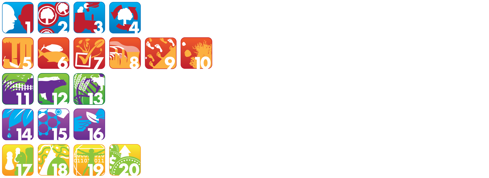]

???

Les objectifs d'Aichi représente 20 objectifs visant à réduire la perte de biodiversité à l'échelle globale et sont divisés en cinq grandes classes.

---

# Les objectifs d'Aichi 2020
<hr width="100%" align="left" size="0.3" color="#33638d"></hr>

<br><br><br>

.center[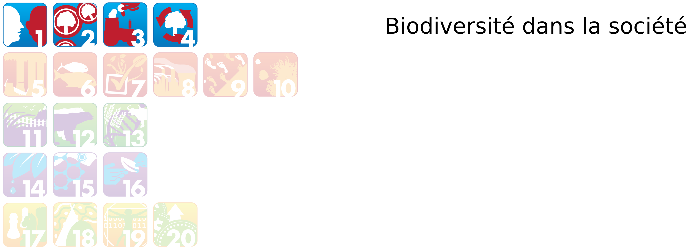]

---

# Les objectifs d'Aichi 2020
<hr width="100%" align="left" size="0.3" color="#33638d"></hr>

<br><br><br>

.center[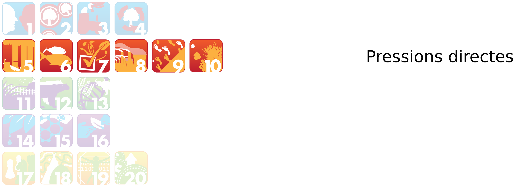]

---

# Les objectifs d'Aichi 2020
<hr width="100%" align="left" size="0.3" color="#33638d"></hr>

<br><br><br>

.center[]

---

# Les objectifs d'Aichi 2020
<hr width="100%" align="left" size="0.3" color="#33638d"></hr>

<br><br><br>

.center[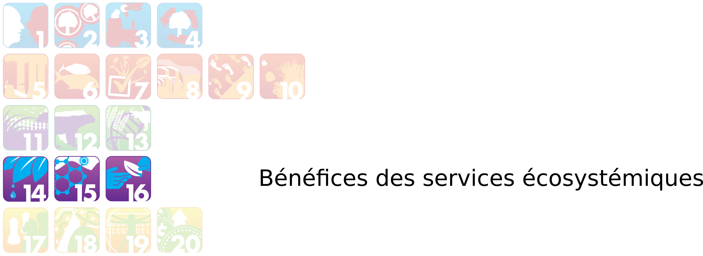]

---

# Les objectifs d'Aichi 2020
<hr width="100%" align="left" size="0.3" color="#33638d"></hr>

<br><br><br>

.center[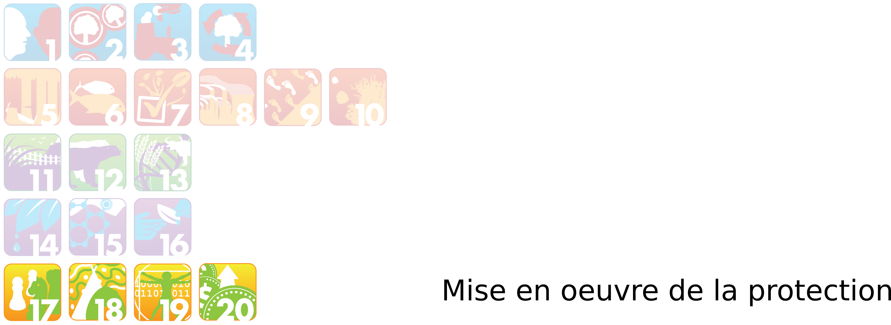]

---

# Les objectifs d'Aichi 2020
<hr width="100%" align="left" size="0.3" color="#33638d"></hr>

<br>

.pull-left[]

???

Dans le cadre de la dernière année de la décennie, la CBD sorti un rapport afin d'évaluer l'atteinte des objectifs d'Aichi.

--

<br><br>

.pull-right[]

---

# Les objectifs d'Aichi 2020
<hr width="100%" align="left" size="0.3" color="#33638d"></hr>

<br>

.pull-left[]

.pull-right[
  <br><br>
- .font120[Perte de biodiversité s'accélère]
  
- .font120[Actions insuffisantes]
]

---

# IPBES
<hr width="100%" align="left" size="0.3" color="#33638d"></hr>

.pull-left[]

???

Les conclusions de ce rapport sont partagées par d'autres rapports, dont celui de la
--

.pull-right[
  
  <br>

  .font120[Plateforme intergouvernementale scientifique et politique sur la biodiversité et les services écosystémiques **(IPBES)**]
  <br>
  .font120[=]
  <br>
  .font120[Groupe d'experts intergouvernemental sur l'évolution du climat (GIEC)]

]

???

L'IPBES créée en 2012

Premier rapport de ce groupe d'expert sur l'état de la biodiversité à l'échelle globale

Ce rapport traite entres autres de la contribution de la nature à la société, des causes des changements de biodiversité, des objectifs de conservation et des capacités à la protéger 

Comme les réseaux d'observations et les programmes de suivis sont encore plutôt rares dans le monde, les experts de l'IPBES se sont concentrés sur les risques d'extinction d'espèces provenant de différentes groupes taxonomiques bien documentés. Il se sont également concentrés sur les pressions anthropiques qui amènent les changements de biodiversité puisque ces données là sont plus accessibles.

---

# IPBES: Les menaces à la biodiversité
<hr width="100%" align="left" size="0.3" color="#33638d"></hr>

<br>

.pull-left[
.font120[**Terrestres:**]

.font120[
- L'utilisation du territoire:
  - agriculture
  - foresterie
  - urbanisation
]

.font120[**Marins:**]

- La pêche
]

--

.pull-right[
.font120[**Extinctions:**]

.font120[
- destruction d’habitats
- surexploitation
- pollution
- introduction d’espèces exotiques
- changements climatiques
]
]
---

# IPBES: Les risques d'extinction
<hr width="100%" align="left" size="0.3" color="#33638d"></hr>

<br>

.center[
  
]

???

Une des figures principales du rapport sur les risques d'extinction.

Ce raport estime à 1 million le nombre d'espèces menacées

Il nous manque encore beaucoup de connaissances pour avoir un portrait complet et global de la biodiversité

---

# IPBES: Les lacunes de connaissances
<hr width="100%" align="left" size="0.3" color="#33638d"></hr>

<br>

.font120[
- Données, inventaires et suivis
]

--


.font120[
- Connaissances sur certains écosystèmes (e.g. eaux douces)
]

--


.font120[
- Taxonomiques
]

--


.font120[
- Apport de la biodiversité aux populations
]

???

La science des changements de biodiversité est encore très jeune. Il est très difficiles d'obtenir de l'information sur des suivis de biodiversité

Les scientifiques s'accordent toutefois pour dire que la biodiversité diminue, du moins à l'échelle globale. Quand on change d'échelle spatiale, ce n'est pas si simple, et certains articles récents qui sont venus ébranler ce que les scientfiques prenaient pour acquis, c'est-à-dire que la biodiversité diminue à toutes les échelles. 

---

# Défis des suivis de biodiversité
<hr width="100%" align="left" size="0.3" color="#33638d"></hr>

<br>

.center[
  
]

???

Ils ont regardé la richesse spécfique à l'échelle locale puisque c'est à cette échelle que la biodiversité est importante pour les services écosystémiques.

Il n'y a pas vraiment de changement net dans la richesse spécifique chez les plantes

Il a été documenté que les perturbations humaines amènent tout autant de nouvelles espèces que celles qui disparaissent et donc que les pertes locales de biodiversité sont moins importantes que présumé

Également un autre papier de Dornelas et collaborateur en 2014 qui démontre qu'à l'échelle locale et régionale, les communautés subissent plus des changements de biodiversité que des pertes de biodiversité 

---

# Défis des suivis de biodiversité
<hr width="100%" align="left" size="0.3" color="#33638d"></hr>

<br><br>
.center[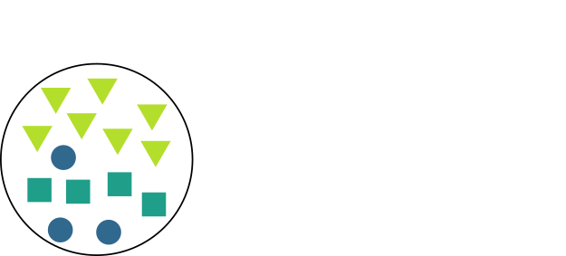]

---

# Défis des suivis de biodiversité
<hr width="100%" align="left" size="0.3" color="#33638d"></hr>

<br><br>
.center[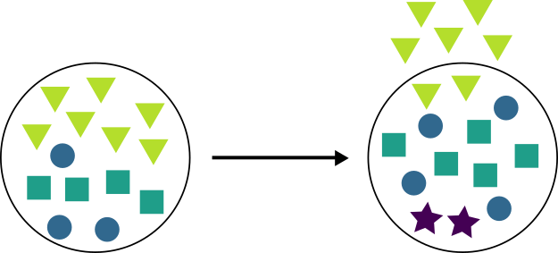]

---

# Défis des suivis de biodiversité
<hr width="100%" align="left" size="0.3" color="#33638d"></hr>

<br><br>
.center[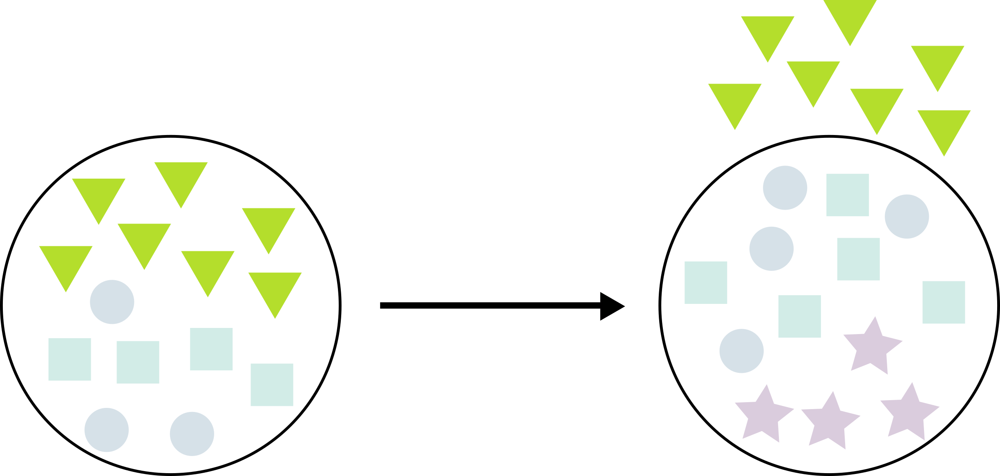]

---

# Défis des suivis de biodiversité
<hr width="100%" align="left" size="0.3" color="#33638d"></hr>

<br><br>
.center[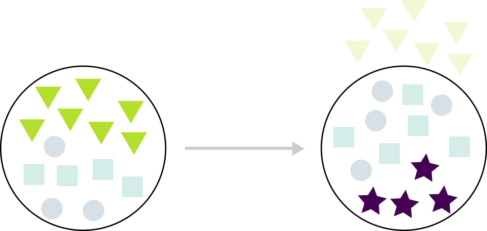]

???

Ces articles ont démontré que l'on est pas si bon pour estimer les changements de biodiversité et qu'il y a encore beaucoup de défis auxquelles nous devons faire face. 

---

# Défis des suivis de biodiversité
<hr width="100%" align="left" size="0.3" color="#33638d"></hr>

<br>

> .font120[La **biodiversité change** et les **risques d'extinction augmentent**]

--

<br>

> .font120[**Incertitudes** sur l'estimation de ces changements]

--

<br>

> .font120[Motivation pour développer des **méthodes de calcul** et **améliorer les suivis de biodiversité**]

---

# Les indicateurs de biodiversité
<hr width="100%" align="left" size="0.3" color="#33638d"></hr>

<br>

.center[
  
]

???

Les indicateurs font parties des outils qui servent à mesurer les changements de biodiversité.
---

# Les indicateurs de biodiversité
<hr width="100%" align="left" size="0.3" color="#33638d"></hr>

<br>

.center[
  
]

???

Ils servent à représenter les changements de manière simplifiée

---

# Les indicateurs de biodiversité
<hr width="100%" align="left" size="0.3" color="#33638d"></hr>

.font120[
  Très utiles pour communiquer aux **décideurs** et au **grand public**
]

--

.pull-left[
  

  
]

--

.pull-right[
.font120[
- Compréhensible

<br>
- Communicable

<br>
- Mesure précise

]
]

???

La mise en place par la Convention sur la Diversité Biologique des objectifs pour la biodiversité de 2010 suivi des objectifs d'Aichi 2020 a grandement accélérer le développement de plusieurs indicateurs. Il en existe aujourd'hui plus de 60. Le Red List Index, le Wild Bird Index et le Living Planet Index font partis des indicateurs les mieux développés et les plus connus. RLI: Risque d'extinction des espèces. WBI: LPI pour les oiseaux

---

# Les indicateurs de biodiversité
<hr width="100%" align="left" size="0.3" color="#33638d"></hr>

<br>

**.font120[Indice liste rouge:]**<br>
  .font120[Risques d'extinction globaux de groupes d'espèces]

<br>
--

**.font120[Indice oiseaux sauvages:]**<br>
  .font120[Tendances moyennes dans les tailles de population d'espèces d'oiseaux]

<br>
--

**.font120[Indice planète vivante:]**<br>
  .font120[Tendances moyennes dans les tailles de population d'espèces de vertébrés]

---

# Indice planète vivante
<hr width="100%" align="left" size="0.3" color="#33638d"></hr>

.font120[
- Mesure le changement moyen de la taille des populations de vertébrés depuis 1970
]

--

.font120[
- Utilise les suivis de population à long terme:
  - **Même méthodologie**
  - Minimum **deux points**
]

--

.font120[
- Peut-être caculer **globalement**, pour une **région précise** ou pour un **groupe taxonomique**
]

---

# Indice planète vivante
<hr width="100%" align="left" size="0.3" color="#33638d"></hr>

- .font120[**Suivi de populations**]

.pull-left[
  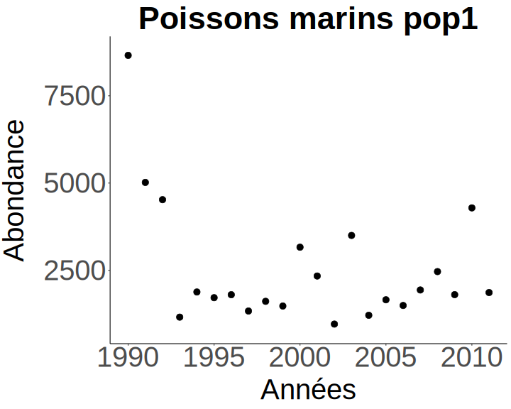
]

.pull-right[
  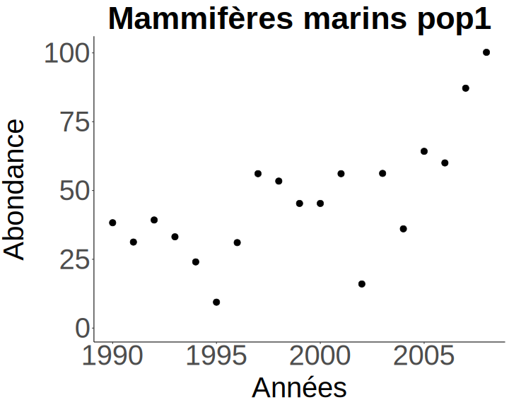
]

<br>

.font120[
  .center[
    Plus toutes les autres populations...
  ]
]

---

# Indice planète vivante
<hr width="100%" align="left" size="0.3" color="#33638d"></hr>

- .font120[**Modèles généralisés additifs**]

.pull-left[
  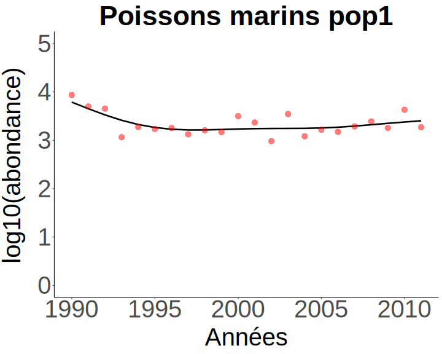
]

.pull-right[
  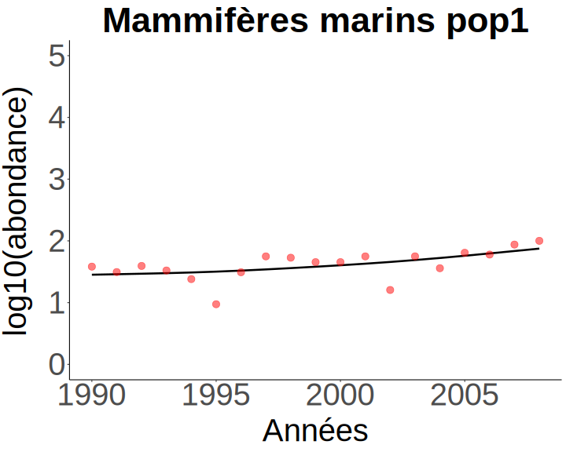
]

---

# Indice planète vivante
<hr width="100%" align="left" size="0.3" color="#33638d"></hr>

- .font120[**Taux de croissance de chaque population**]

<div style="position: relative; left: -9vh">$$d_t = log_{10}(\frac{N_t}{N_{t-1}}), \;\; N = abondance$$</div>

--

.pull-left[
  
]

.pull-right[
  
]

---

# Indice planète vivante
<hr width="100%" align="left" size="0.3" color="#33638d"></hr>

- .font120[**Taux de croissance moyen de chaque taxon par système**]

<div style="position: relative; left: -9vh">$$\bar{d}_t = \frac{1}{n} \sum_{i=1}^{n} d_{i,t}, \;\; n = nombre \: de \: pop$$</div>

--

.pull-left[
  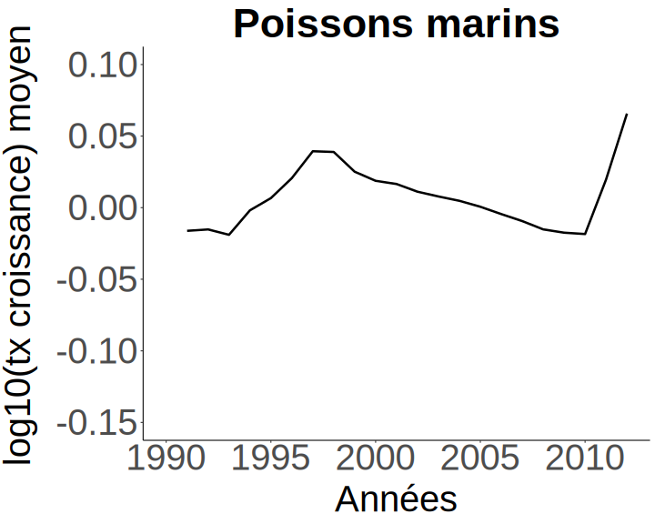
]

--

.pull-right[
  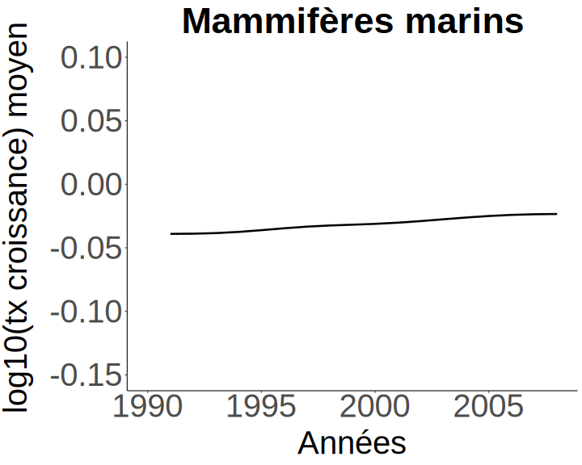
]

---

# Indice planète vivante
<hr width="100%" align="left" size="0.3" color="#33638d"></hr>

- .font120[**Taux de croissance moyen par système**]

<div style="position: relative; left: -9vh">$$\bar{d}_t = \frac{1}{n} \sum_{i=1}^{n} d_{i,t}, \;\; n = nombre \: de \: pops$$</div>

.pull-left[
  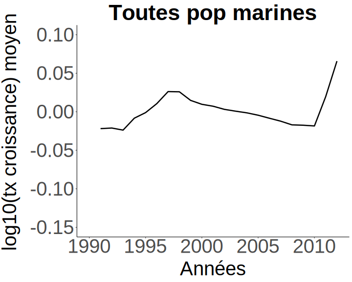
]

--

.pull-right[
  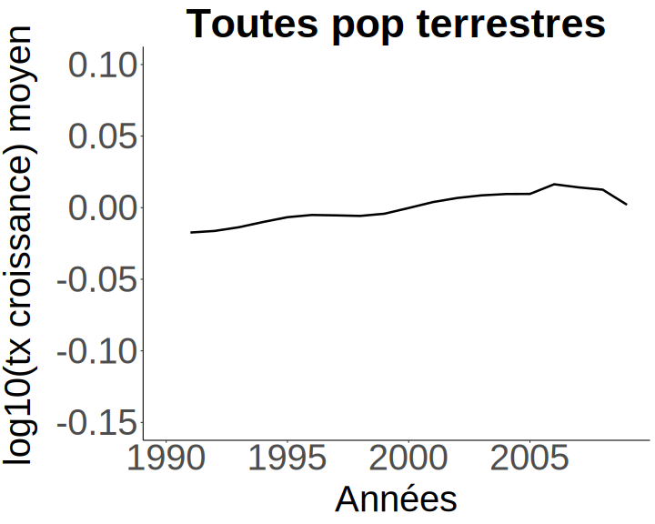
]

---

# Indice planète vivante
<hr width="100%" align="left" size="0.3" color="#33638d"></hr>

- .font120[**Taux de croissance moyen global**]

<div style="position: relative; left: -9vh">$$\bar{d}_t = \frac{1}{n} \sum_{i=1}^{n} d_{i,t}, \;\; n = nombre \: de \: pops$$</div>

.center[
  
]

---

# Indice planète vivante
<hr width="100%" align="left" size="0.3" color="#33638d"></hr>

- .font120[**Calcul de l'indice**]

<div style="position: relative; left: 5vh;">$$I_t = I_{t-1} 10^{\bar{d}_t}$$</div>
 
<br><br>

.center[
  
]

---

# Les indicateurs à l'échelle globale
<hr width="100%" align="left" size="0.3" color="#33638d"></hr>

.font120[**Indice planète vivante**]

.center[
  
]

---

# Les indicateurs à l'échelle globale
<hr width="100%" align="left" size="0.3" color="#33638d"></hr>

<br>

.center[
  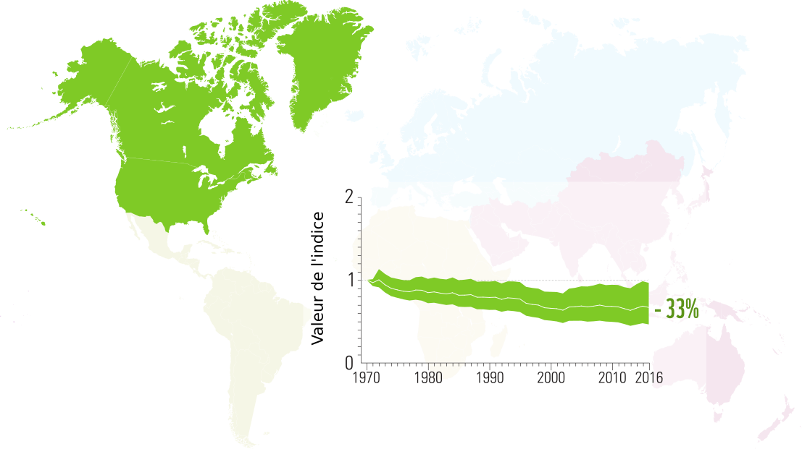
]

---

# Les indicateurs à l'échelle globale
<hr width="100%" align="left" size="0.3" color="#33638d"></hr>

<br>

.center[
  
]

---

# Les indicateurs à l'échelle globale
<hr width="100%" align="left" size="0.3" color="#33638d"></hr>

<br>

.center[
  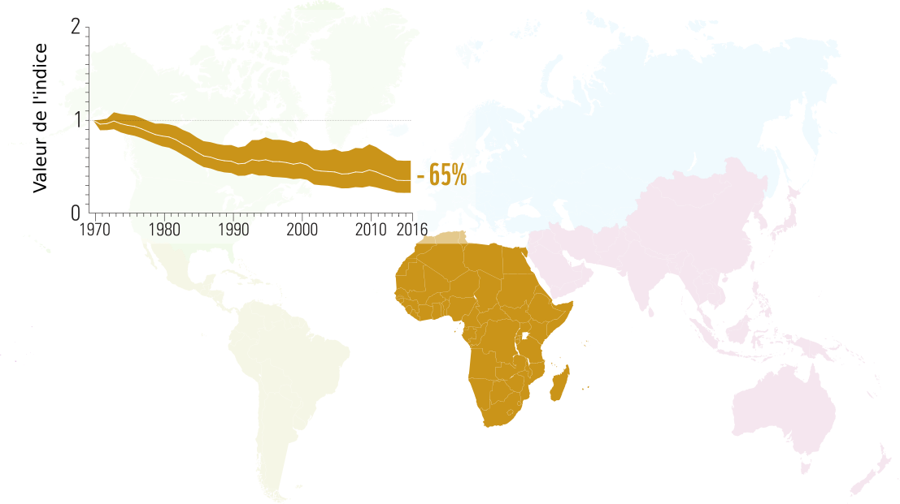
]

---

# Les indicateurs à l'échelle globale
<hr width="100%" align="left" size="0.3" color="#33638d"></hr>

<br>

.center[
  
]

---

# Les indicateurs à l'échelle globale
<hr width="100%" align="left" size="0.3" color="#33638d"></hr>

<br>

- .font180[Déclin globale]

--

<br>

- .font180[Mais...]

---

# Les indicateurs à l'échelle globale
<hr width="100%" align="left" size="0.3" color="#33638d"></hr>

<br>

.center[
  
]

???

Dornelas et collaborateur en 2019: En gros, il y a des gagnants et des perdants. 85% des populations ont un taux de croissance nul

---

# Les indicateurs à l'échelle globale
<hr width="100%" align="left" size="0.3" color="#33638d"></hr>

<br>

.center[
  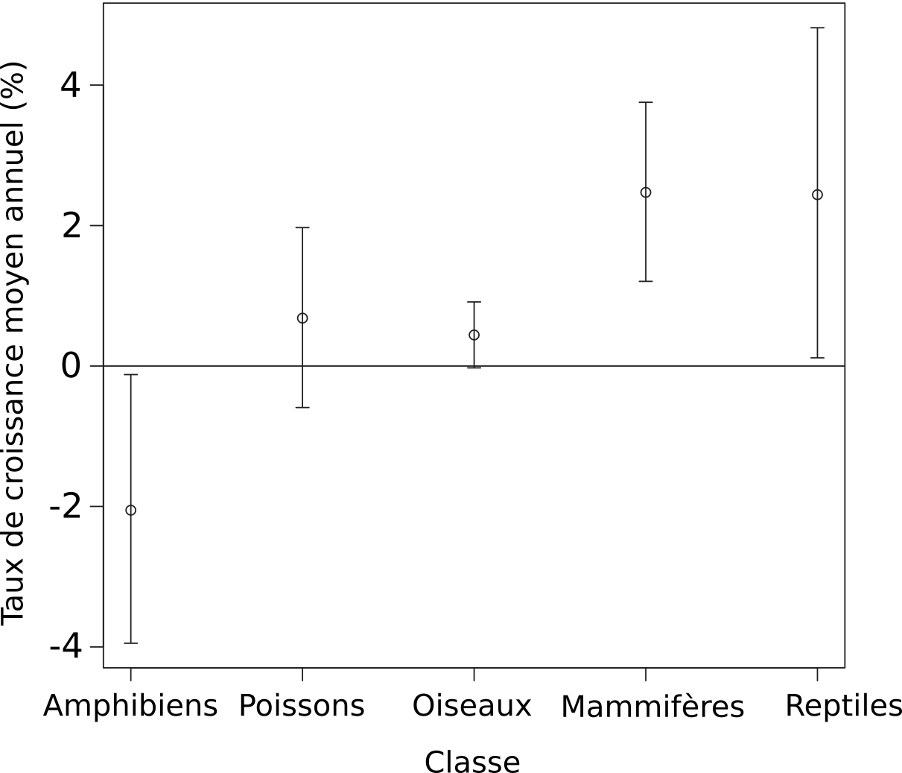
]

???

Il n'y a que les amphibiens qui subissent un réel déclin significatif

---

# Les indicateurs à l'échelle globale
<hr width="100%" align="left" size="0.3" color="#33638d"></hr>

<br>

.center[
  
]

???

Le grand déclin obtenu avec le LPI n'est en fait que le résultat de quelques populations dont le déclin est extrême. Lorsqu'on retire ces populations, l'indice tourne autour de 0.

---

# Les indicateurs à l'échelle globale
<hr width="100%" align="left" size="0.3" color="#33638d"></hr>

<br>

.center[
  
]

---

# Les indicateurs à l'échelle globale
<hr width="100%" align="left" size="0.3" color="#33638d"></hr>

<br>

.center[
  
]

---

# Les indicateurs à l'échelle globale
<hr width="100%" align="left" size="0.3" color="#33638d"></hr>

<br>

.center[
  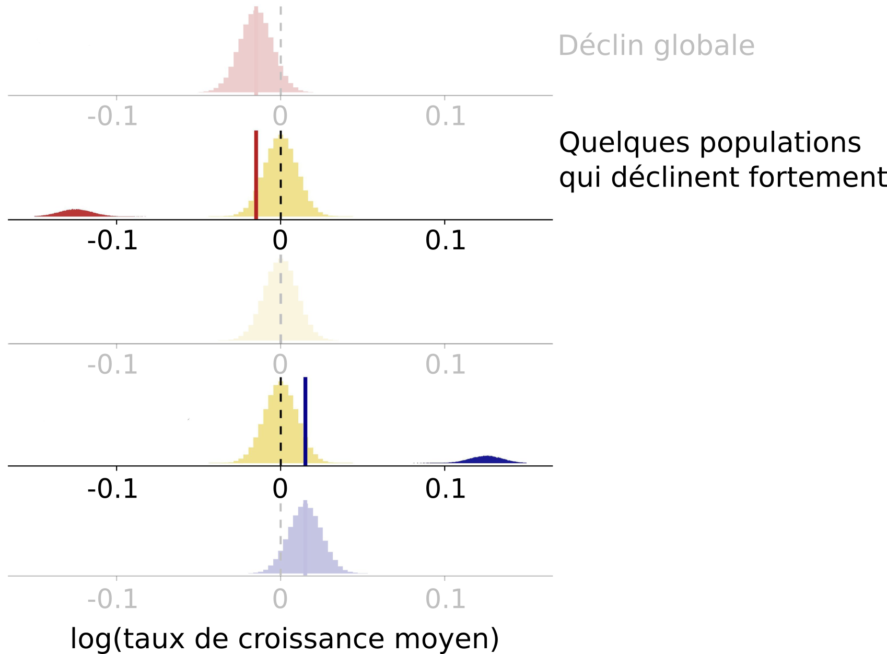
]

---

# Les indicateurs à l'échelle globale
<hr width="100%" align="left" size="0.3" color="#33638d"></hr>

<br>

.center[
  
]

---

# Les indicateurs à l'échelle globale
<hr width="100%" align="left" size="0.3" color="#33638d"></hr>

<br>

.font150[Message plus **nuancé**:]

- .font150[**Grande variabilité** dans les **régions** et les groupes **taxonomiques**]

--

.font150[Oiseaux et mammifères aquatiques + oiseaux terrestres de **l'Indo-Pacifique**:]

- .font150[**Déclin significatif**]

---

# Les indicateurs à l'échelle globale
<hr width="100%" align="left" size="0.3" color="#33638d"></hr>

.font120[**Indice liste rouge**: Risques d'extinction]


.center[
  
]

---

# Les indicateurs à l'échelle globale
<hr width="100%" align="left" size="0.3" color="#33638d"></hr>

.font120[**Indice oiseaux sauvages**: Amérique du Nord et Europe]

.center[
  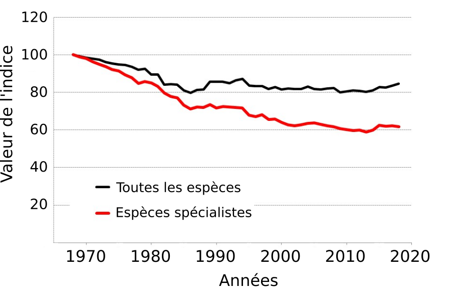
]

---

# Les indicateurs à l'échelle globale
<hr width="100%" align="left" size="0.3" color="#33638d"></hr>

<br>

- .font150[Biodiversité **diminue**, mais **difficile** de faire un **portrait global**]

--

<br>

- .font150[Les **suivis nationaux** sont nécessaires]

---

# Les indicateurs au Canada
<hr width="100%" align="left" size="0.3" color="#33638d"></hr>

.font120[**Indice planète vivante**]

<br>

.center[
  
]

---

# Les indicateurs au Canada
<hr width="100%" align="left" size="0.3" color="#33638d"></hr>

.font120[**Indice des espèces canadiennes**]

<br>

.center[
  
]

---

# Les indicateurs au Canada
<hr width="100%" align="left" size="0.3" color="#33638d"></hr>

.font120[**États des oiseaux du Canada**]

<br>

.center[
  
]

???

C'est donc important d'avoir des indicateurs qui puissent se décortiquer afin de bien identifier les régions et les taxons qui sont réellement en déclin et de faire un meilleur portrait de l'ensemble de la siatuation

Le Canada a plusieurs indicateurs de biodiversité, mais on ne peut pas nécessairement les utiliser lorsqu'on veut parler de la biodiversité au Québec

---

# Les suivis de biodiversité au Québec
<hr width="100%" align="left" size="0.3" color="#33638d"></hr>

- .font120[**Aucun suivi** de biodiversité à **long terme**]

--

- .font120[Centre de données sur le patrimoine naturel du Québec : **espèces à statut**]

--

- .font120[Manque de données (e.g. **suivis à long terme de populations**)]

--

- .font120[Orientation du gouvernement]

  >.font120[**Évaluation** de la **biodiversité** et **élaboration** d’un **réseau de suivi**]

---

# Questions
<hr width="100%" align="left" size="0.3" color="#33638d"></hr>
<br>

> .font110[Quels sont les **changements de biodiversité au Québec** dans les **dernières décennies**?]

<br>

--

<br>

> .font110[Est-il possible de développer un **indice** utilisant les **données d'occurrence et d'abondance** disponibles?]

---

# Objectifs
<hr width="100%" align="left" size="0.3" color="#33638d"></hr>
<br>
.font110[Objectif général:]
<br><br>
> **.font120[.center[Développer un indice de changement de biodiversité basé sur les changements de distribution des espèces]]**

<br><br>
--

.font110[Objectif secondaire:]
<br><br>
>**.font120[.center[Développer le pipeline qui permettra d'automatiser le calcul de l'indice avec la base de données ATLAS et de représenter le résultat au moyen d'un outil web interactif]]**

---

# Méthodes
<hr width="100%" align="left" size="0.3" color="#33638d"></hr>

.center[]

---

# Méthodes
<hr width="100%" align="left" size="0.3" color="#33638d"></hr>

.center[]

---

# Méthodes
<hr width="100%" align="left" size="0.3" color="#33638d"></hr>

.center[]

.font110[
- **Données d'abondance et d'occurrence** des espèces du **Québec**
  - Au-dessus de **130 millions d'observations** d'environ **1000 espèces**
]
--
.font110[
- Proviennent de **plusieurs sources** dont:
  - Gouvernementales
  - Bases de données ouvertes (e.g. GBIF)
  - Science citoyenne
]
--
.font110[
- **Standard d'informations** pour les observations sur la biodiversité au Québec
]

---

# Méthodes
<hr width="100%" align="left" size="0.3" color="#33638d"></hr>

.center[]

---

# Méthodes
<hr width="100%" align="left" size="0.3" color="#33638d"></hr>

.center[]

.left[]

---

# Méthodes
<hr width="100%" align="left" size="0.3" color="#33638d"></hr>

.center[]

.left[]

--

<div style="float: right; position: relative; font-size: 120%; top: -21vh; left: -8vh;">3km x 3km</div>
<div style="float: right; position: relative; font-size: 120%; top: -17vh; left: 9vh;">(312000 cellules)</div>

--

.right[]

--

.right[]

---

# Méthodes
<hr width="100%" align="left" size="0.3" color="#33638d"></hr>

.center[]

---

# Méthodes
<hr width="100%" align="left" size="0.3" color="#33638d"></hr>

.center[
  
  
]
---

# Méthodes
<hr width="100%" align="left" size="0.3" color="#33638d"></hr>

- .font120[**Somme des probabilités d'occurrence**]

<br>

.pull-left[
  
]

.pull-right[
  
]

---

# Méthodes
<hr width="100%" align="left" size="0.3" color="#33638d"></hr>

- .font120[**Taux de croissance des aires de chaque espèce**]

<div style="position: relative; left: -13vh">$$d_t = log_{10}(\frac{A_t}{A_{t-1}}), \;\; A = aires \; de \; distribution$$</div>

--

.pull-left[
  
]

.pull-right[
  
]

---

# Méthodes
<hr width="100%" align="left" size="0.3" color="#33638d"></hr>

- .font120[**Taux de croissance moyen des aires**]

<div style="position: relative; left: -9vh">$$\bar{d}_t = \frac{1}{n} \sum_{i=1}^{n} d_{i,t}, \;\; n = nombre \; d'espece$$</div>

--

.center[
  
]

---

# Méthodes
<hr width="100%" align="left" size="0.3" color="#33638d"></hr>

- .font120[**Calcul de l'indice**]

<div style="position: relative; left: 5vh;">$$I_t = I_{t-1} 10^{\bar{d}_t}$$</div>
 
<br>

<br>


.center[
  
]

---

# Limites
<hr width="100%" align="left" size="0.3" color="#33638d"></hr>

- .font120[Approche grossière]

--

- .font120[Oiseaux seulement]

--

- .font120[Problèmes de détection des observations (fausses présences et fausses absences)]

--

- .font120[Les résultats dépendent de la qualité des modèles]

---

# Avantages
<hr width="100%" align="left" size="0.3" color="#33638d"></hr>

- .font120[Peut-être utilisée peu importe le modèle]

--

- .font120[Permet de calculer un indice pour les endroits où peu de données disponibles]

--

- .font120[Basé sur une méthodologie déjà connue]

---

# Avancement
<hr width="100%" align="left" size="0.3" color="#33638d"></hr>

- .font120[Harmonisations des données sur Atlas]

--

  - .font120[Validation des données + taxonomies]

--

- .font120[Librairie R pour les SDMs en développement]

--

- .font120[Librairie R pour le calcul de l'indice en développement]

---

# Pour la suite
<hr width="100%" align="left" size="0.3" color="#33638d"></hr>

- .font120[Partionner entre les colonisations et les extinctions]

--

- .font120[Appliquer le modèle de Leung2020]

--

- .font120[Étudier les propriétés de l'indice, notamment l'incertitude]

--

- .font120[Corrélation entre variation biodiversité et pressions anthropiques]
