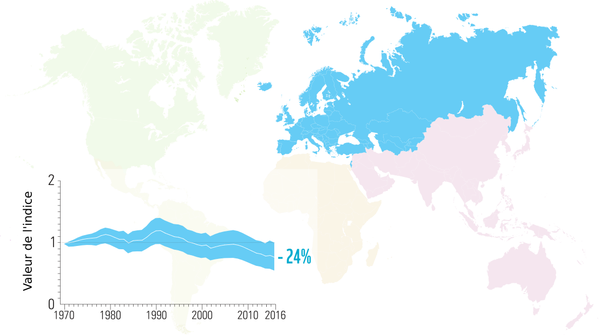
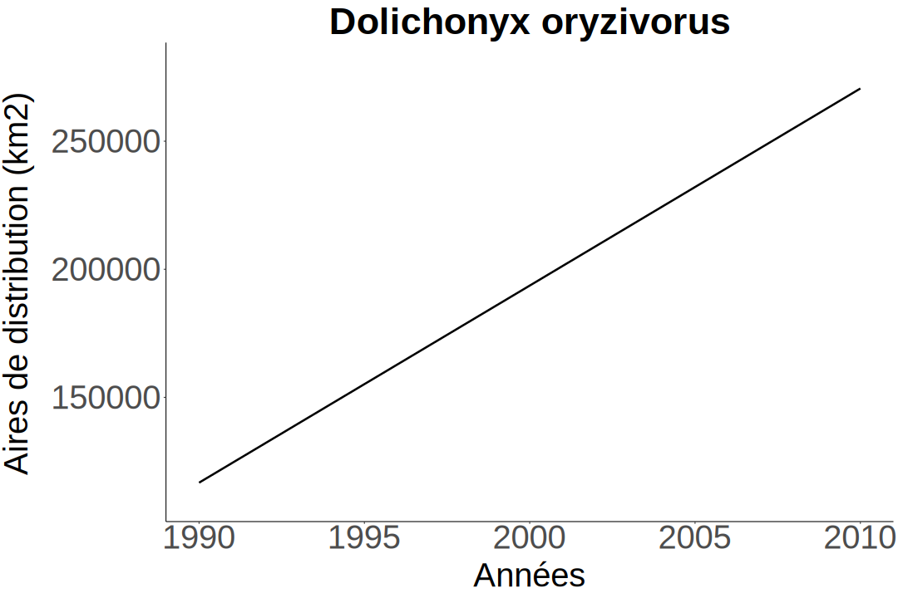

```{r setup, echo = F}
knitr::opts_chunk$set(
  comment = "#",
  #cache = TRUE,
  collapse = TRUE,
  warning = FALSE,
  message = FALSE,
  fig.width = 7,
  fig.height = 5.25,
  fig.align = 'center',
  fig.retina = 3
)

# base plot layout
mypar = list(mar = c(3,3,0.5,0.5), mgp = c(1.5, 0.3, 0), tck = -.008)

# xaringan Extra
xaringanExtra::use_xaringan_extra(c("tile_view", "animate_css", "tachyons"))
xaringanExtra::use_extra_styles(
  hover_code_line = TRUE,         #<<
  mute_unhighlighted_code = TRUE  #<<
)
xaringanExtra::use_editable(expires = 1)
xaringanExtra::use_panelset()
```
class: middle, title-slide

<div class="my-logo-left"></div>

# Biodiversity
# Distribution Index

<hr width="60%" align="left" size="0.3" color="#33638d"></hr>

## Un indicateur de biodiversité du Québec

### Vincent Bellavance

<br>
<i class="fa fa-github fa-lg" style="color:#e7e8e2"></i> [VincentBellavance/seminar1](https://github.com/VincentBellavance/seminar1)

<i class="fa fa-twitter fa-lg" style="color:#e7e8e2"></i> [@v_bellavance](https://twitter.com/v_bellavance)

???

Bonjour tout le monde, je suis Vincent Bellavance, étudiant à la maitrise dans le laboratoire de Dominique Gravel. Je vais vous présenter mon projet qui porte sur le développement d'un nouvel indicateur de changement de biodiversité pour le Québec, le Biodiversity Distribution Index.

---

# Les objectifs d'Aichi 2020
<hr width="100%" align="left" size="0.3" color="#33638d"></hr>

<br><br>
.center[]
<br><br>

???

C'est cette année que se terminait la décennie pour la biodiversité qui a été déclarée par l'ONU en 2011.

--

.pull-left[]

???

Cette décennie servait à promouvoir les objectifs d'Aichi 2020. Représsente 20 objectifs différentes qui vise à réduire la perte de biodiversité à l'échelle globale

--

.pull-right[]

???

qui a été adopté par les parties de la Convention sur la Diversité Biologique, un traité international signé par plus de 160 pays en 1992 qui vise la conservation de la biodiversité.

---

# Les objectifs d'Aichi 2020
<hr width="100%" align="left" size="0.3" color="#33638d"></hr>

<br>

.pull-left[]

.cite[CBD 2020]

???

Dans le cadre de la dernière année de la décennie, la CBD sorti un rapport afin d'évaluer l'atteinte des objectifs d'Aichi.

--

<br><br>

.pull-right[]

---

# Les objectifs d'Aichi 2020
<hr width="100%" align="left" size="0.3" color="#33638d"></hr>

<br>

.pull-left[]

.pull-right[
  <br><br>
- .font120[Perte de biodiversité s'accélère]
  
- .font120[Actions insuffisantes]
]

.cite[CBD 2020]

---

# IPBES
<hr width="100%" align="left" size="0.3" color="#33638d"></hr>

.pull-left[]

.cite[IPBES 2019]

???

Les conclusions de ce rapport sont partagées par d'autres rapports, dont celui de la
--

.pull-right[
  
  <br>

  .font120[Plateforme intergouvernementale scientifique et politique sur la biodiversité et les services écosystémiques **(IPBES)**]
  <br>
  .font120[=]
  <br>
  .font120[Groupe d'experts intergouvernemental sur l'évolution du climat (GIEC)]

]

???

L'IPBES créée en 2012

Premier rapport de ce groupe d'expert sur l'état de la biodiversité à l'échelle globale

Ce rapport s'est concentré sur les risques d'extinction des espèces et l'évolution des changements environnementaux qui sont à l'origine des changements de biodiversité

---

# IPBES: Les menaces à la biodiversité
<hr width="100%" align="left" size="0.3" color="#33638d"></hr>

<br>
.pull-left[
.font120[**Terrestres:**]

.font120[
- L'utilisation du territoire:
  - agriculture
  - foresterie
  - urbanisation
]

.font120[**Marins:**]

- .font120[La pêche]
]

--

.pull-right[
.font120[**Déclins:**]

.font120[
- Destruction d’habitats
- Surexploitation
- Pollution
- Introduction d’espèces exotiques
- Changements climatiques
]
]

---

# IPBES: Les risques d'extinction
<hr width="100%" align="left" size="0.3" color="#33638d"></hr>

<br>

.center[
  
]

.cite[IPBES 2019]

???

Une des figures principales du rapport sur les risques d'extinction.

Ce raport estime à 1 million le nombre d'espèces menacées

Il nous manque encore beaucoup de connaissances pour avoir un portrait complet et global de la biodiversité

Les scientifiques s'accordent généralement pour dire que la biodiversité diminue, du moins à l'échelle globale. Quand on change d'échelle spatiale, ce n'est pas si simple, et certains articles récents qui sont venus ébranler ce que les scientfiques prenaient pour acquis, c'est-à-dire que la biodiversité diminue à toutes les échelles. 

---

# Défis des suivis de biodiversité
<hr width="100%" align="left" size="0.3" color="#33638d"></hr>

<br>

.center[
  
]

.cite[Vellend et al. [2013] Proc. Natl. Acad. Sci. U.S.A.]

???

Ils ont regardé la richesse spécfique à l'échelle locale puisque c'est à cette échelle que la biodiversité est importante pour les services écosystémiques.

Il n'y a pas vraiment de changement net dans la richesse spécifique chez les plantes

Il y a tout autant nouvelles espèces que celles qui disparaissent et donc que les pertes locales de biodiversité sont moins importantes que présumé

---

# Défis des suivis de biodiversité
<hr width="100%" align="left" size="0.3" color="#33638d"></hr>

<br>

> .font120[La **biodiversité change** et les **risques d'extinction augmentent**]

???

Par contre, ces articles ne nient pas qu'il y a un déclin à l'échelle globale
--

<br>

> .font120[**Incertitudes** sur l'estimation de ces changements]

???

Ces articles ont démontré que l'on est pas si bon pour estimer les changements de biodiversité à toute les échelles et qu'il y a encore beaucoup de défis auxquelles nous devons faire face. 

--

<br>

> .font120[Motivation pour développer des **méthodes de calcul** et **améliorer les suivis de biodiversité**]

---

# Les indicateurs de biodiversité
<hr width="100%" align="left" size="0.3" color="#33638d"></hr>

<br>

.center[
  
]

???

Les indicateurs font parties des outils qui servent à mesurer les changements de biodiversité.
---

# Les indicateurs de biodiversité
<hr width="100%" align="left" size="0.3" color="#33638d"></hr>

<br>

.center[
  
]

???

Ils servent à représenter les changements de manière simplifiée

---

# Les indicateurs de biodiversité
<hr width="100%" align="left" size="0.3" color="#33638d"></hr>

.font120[
  Très utiles pour communiquer aux **décideurs** et au **grand public**
]

--

.pull-left[
  

  
]

--

.pull-right[
.font120[
- Compréhensible

<br>
- Communicable

<br>
- Mesure précise

]
]

???

La mise en place par la Convention sur la Diversité Biologique des objectifs pour la biodiversité de 2010 suivi des objectifs d'Aichi 2020 a grandement accélérer le développement de plusieurs indicateurs. Il en existe aujourd'hui plus de 60. Le Red List Index, le Wild Bird Index et le Living Planet Index font partis des indicateurs les mieux développés et les plus connus. RLI: Risque d'extinction des espèces. WBI: LPI pour les oiseaux

---

# Indice Planète Vivante
<hr width="100%" align="left" size="0.3" color="#33638d"></hr>

.font120[
- Mesure le changement moyen de la taille des populations de vertébrés depuis 1970
]

--

.font120[
- Utilise les suivis de population à long terme:
  - **Même méthodologie**
  - Minimum **deux points**
]

--

.font120[
- Peut-être calculer **globalement**, pour une **région précise** ou pour un **groupe taxonomique**
]

---

# Indice Planète Vivante
<hr width="100%" align="left" size="0.3" color="#33638d"></hr>

- .font120[**Taux de croissance de chaque population**]

.pull-left[
  
]

.pull-right[
  
]

---

# Indice Planète Vivante
<hr width="100%" align="left" size="0.3" color="#33638d"></hr>

- .font120[**Taux de croissance moyen global**]

<br>

.center[
  
]

---

# Indice Planète Vivante
<hr width="100%" align="left" size="0.3" color="#33638d"></hr>

- .font120[**Calcul de l'indice**]

<div style="position: relative; left: 5vh;">$$I_t = I_{t-1} 10^{\bar{d}_t}$$</div>
 
<br><br>

.center[
  
]

---

# Les indicateurs à l'échelle globale
<hr width="100%" align="left" size="0.3" color="#33638d"></hr>

.font120[**Indice planète vivante**]

.center[
  
]

.cite[WWF [2020]]

???

Dans le dernier rapport de l'Indice Planète Vivante, il est rapporté que la taille moyenne des populations de vertébrés à travers le monde a diminué de 68%

Ils ont également calculé l'indice selon des grandes régions et il y a une grande variabilité de l'indicateur entre les différentes régions.

---

# Les indicateurs à l'échelle globale
<hr width="100%" align="left" size="0.3" color="#33638d"></hr>

<br>

.center[
  
]

.cite[WWF [2020]]

---

# Les indicateurs à l'échelle globale
<hr width="100%" align="left" size="0.3" color="#33638d"></hr>

<br>

.center[
  
]

.cite[WWF [2020]]

---

# Les indicateurs à l'échelle globale
<hr width="100%" align="left" size="0.3" color="#33638d"></hr>

<br>

- .font180[Déclin globale]

???

Donc, le message du rapport du LPI est qu'il y a un fort déclin des populations de vertébrés dans le monde

--

<br>

- .font180[Mais...]

???

Mais, il y a quelques articles qui viennent nuancer le message du rapport de l'Indice Planète Vivante.

---

# Les indicateurs à l'échelle globale
<hr width="100%" align="left" size="0.3" color="#33638d"></hr>

<br>

.center[
  
]

.cite[Dornelas et al. [2019] Ecol. Lett]

???

Dornelas et collaborateur en 2019. Avec le même jeu de données que le LPI, ils ont vu que 85% des populations ont un taux de croissance nul. Le reste des 15% sont en croissance ou en décroissance de manière égale. Au final, Pas de changement net.

---

# Les indicateurs à l'échelle globale
<hr width="100%" align="left" size="0.3" color="#33638d"></hr>

<br>

.center[
  
]

.cite[Leung et al. [2020] Nature]

???

Le grand déclin obtenu avec le LPI n'est en fait que le résultat de quelques populations dont le déclin est extrême. Lorsqu'on retire ces populations, l'indice tourne autour de 1.

---

# Les indicateurs à l'échelle globale
<hr width="100%" align="left" size="0.3" color="#33638d"></hr>

<br>

.font150[Message plus **nuancé**:]

- .font150[**Grande variabilité** dans les **régions** et les groupes **taxonomiques**]

---

# Les indicateurs à l'échelle globale
<hr width="100%" align="left" size="0.3" color="#33638d"></hr>

.font120[**Indice liste rouge (Red List Index)**: Risques d'extinction]


.center[
  
]

.cite[IUCN [2020]]

---

# Les indicateurs à l'échelle globale
<hr width="100%" align="left" size="0.3" color="#33638d"></hr>

<br>

- .font150[Biodiversité **diminue**, mais **difficile** de faire un **portrait global**]

???

Les scientifiques s'entendent généralement pour dire que la biodiversité à l'échelle globale diminue. C'est toutefois difficile de faire un portrait global en tenant compte de toute la variabilité dans ces changements.

--

<br>

- .font150[Les **suivis nationaux** sont nécessaires]

???

Les suivis nationaux sont donc nécessaires puisque ça permet d'avoir une idée plus précise de l'état de la biodiversité dans un pays. C'est très important puisque c'est les pays qui vont adopter les politiques de conservation.

---

# Les indicateurs au Canada
<hr width="100%" align="left" size="0.3" color="#33638d"></hr>

.font120[**Indice planète vivante**]

<br>

.center[
  
]

.cite[WWF Canada [2020]]

---

# Les indicateurs au Canada
<hr width="100%" align="left" size="0.3" color="#33638d"></hr>

.font120[**Indice des espèces canadiennes**]

<br>

.center[
  
]

.cite[Environnement Canada [2019]]

---

# Les indicateurs au Canada
<hr width="100%" align="left" size="0.3" color="#33638d"></hr>

.font120[**États des oiseaux du Canada (2019)**]

<br>

.center[
  
]

.cite[IOCAN [2019]]

???

Initiative de conservations des oiseaux de l'Amérique du Nord

Le Canada a plusieurs indicateurs de biodiversité et on peut voir que les changements de biodiversité documenté par les indicateurs sont très différents de ceux à l'échelle globale. Par contre, si on veut avoir une idée de l'état de la biodiversité à l'échelle de la province, on ne peut pas nécessairement les utiliser puisqu'il y a également une grande variabilité dans les changements de biodiversité.

---

# Les suivis de biodiversité au Québec
<hr width="100%" align="left" size="0.3" color="#33638d"></hr>

- .font120[**Aucun suivi** de biodiversité à **long terme**]

--

- .font120[Centre de données sur le patrimoine naturel du Québec : **espèces à statut**]

--

- .font120[Manque de données (e.g. **suivis à long terme de populations**)]

--

- .font120[Orientation du gouvernement]

  >.font120[**Évaluation** de la **biodiversité** et **élaboration** d’un **réseau de suivi**]

???

C'est important d'avoir ce genre de suivi, surtout que l'évaluation de la biodiversité et l'élaboration d'un réseau de suivi de la biodiversité fait partie des orientation du gouvernement en matière de biodiversité. 

---

# Questions
<hr width="100%" align="left" size="0.3" color="#33638d"></hr>
<br>

> .font110[Quels sont les **changements de biodiversité au Québec** dans les **dernières décennies**?]

<br>

--

<br>

> .font110[Est-il possible de développer un **indice** utilisant les **données d'occurrence et d'abondance** disponibles?]

---

# Objectifs
<hr width="100%" align="left" size="0.3" color="#33638d"></hr>
<br>
.font110[Objectif général:]
<br><br>
> **.font120[.center[Développer un indice de changement de biodiversité basé sur les changements de distribution des espèces]]**

<br><br>
--

.font110[Objectif secondaire:]
<br><br>
>**.font120[.center[Développer le pipeline qui permettra d'automatiser le calcul de l'indice avec la base de données ATLAS et de représenter le résultat au moyen d'un outil web interactif]]**

---

# Méthodes
<hr width="100%" align="left" size="0.3" color="#33638d"></hr>

.center[]

---

# Méthodes
<hr width="100%" align="left" size="0.3" color="#33638d"></hr>

.center[]

???

Base de données commencé en 2019, toujours en développement, notamment pour ce qui est de la validation des données et de la taxonomie, et de l'injection de données. 
---

# Méthodes
<hr width="100%" align="left" size="0.3" color="#33638d"></hr>

.center[]

.font110[
- **Données d'abondance et d'occurrence** des espèces du **Québec**
  - Au-dessus de **130 millions d'observations** d'environ **1000 espèces**
]
--
.font110[
- Proviennent de **plusieurs sources** dont:
  - Gouvernementales
  - Bases de données ouvertes (e.g. GBIF)
  - Science citoyenne (e.g. eBird)
]
--
.font110[
- **Standard d'informations** pour les observations sur la biodiversité au Québec
]

---

# Méthodes
<hr width="100%" align="left" size="0.3" color="#33638d"></hr>

.center[]

???

Une librairie R qui est présentement développée par le laboratoire, pour calculer les aires de distribution des espèces présentes dans Atlas. Je ne m'occuperai pas spécifiquement des aires de distribution, mais je vais utiliser les aires de distribution dans le pipeline pour automatiser le calcul de l'indice.

---

# Méthodes
<hr width="100%" align="left" size="0.3" color="#33638d"></hr>

.center[]

.left[]

???

Ce modèle est un exemple de ce qui a été fait jusqu'à présent avec la librarie mapSpecies.
--

<div style="float: right; position: relative; font-size: 120%; top: -21vh; left: -8vh;">3km x 3km</div>
<div style="float: right; position: relative; font-size: 120%; top: -17vh; left: 9vh;">(312000 cellules)</div>

???

Pour l'instant, le Québec est divisé en 312000 cellules de 3km par 3km. 
---

# Méthodes
<hr width="100%" align="left" size="0.3" color="#33638d"></hr>

.center[]

.left[]

<div style="float: right; position: relative; font-size: 120%; top: -21vh; left: -8vh;">3km x 3km</div>
<div style="float: right; position: relative; font-size: 120%; top: -17vh; left: 9vh;">(312000 cellules)</div>

???

Chaque cellule représente une probabilité d'occurrence qui va de 0 à 1. 
--

.right[]

???

Les aires de distribution sont modélisées en utilisant les conditions environnementales comme la température et les précipitations. On utilise également le temps (les années) comme variable explicative. 
--

.right[]

???

Donc, à la place de faire un modèle différent par année, on souhaite faire un seul modèle qui prend en compte le temps, ce qui va permettre de lisser la distribution de l'espèce d'année en année, un peu comme dans la méthode où on utilise les GAMs pour venir lisser les abondances d'espèces.
---

# Méthodes
<hr width="100%" align="left" size="0.3" color="#33638d"></hr>

.center[]

???

Vient ensuite le calcul de l'indice. Je développe présentement la librairie pour faire les calculs sur R. 
---

# Méthodes
<hr width="100%" align="left" size="0.3" color="#33638d"></hr>

.center[
  
  
]

---

# Méthodes
<hr width="100%" align="left" size="0.3" color="#33638d"></hr>

.font120[**Calcul de l'aire de distribution**]

.center[
  
]

---

# Méthodes
<hr width="100%" align="left" size="0.3" color="#33638d"></hr>

.font120[**Calcul de l'aire de distribution**]

.center[
  
]

--

<br>

<div style="position: relative; left: -6vh">$$(3km \times 3km) \times 50\% = 4.5km^2$$</div>

---

# Méthodes
<hr width="100%" align="left" size="0.3" color="#33638d"></hr>

.font120[**Calcul de l'aire de distribution**]

<br>

.pull-left[
  
]

.pull-right[
  
]

---

# Méthodes
<hr width="100%" align="left" size="0.3" color="#33638d"></hr>

.font120[**Taux de croissance des aires de chaque espèce**]

<div style="position: relative; left: -13vh">$$d_t = log_{10}(\frac{A_t}{A_{t-1}}), \;\; A = aires \; de \; distribution$$</div>

--

.pull-left[
  
]

.pull-right[
  
]

---

# Méthodes
<hr width="100%" align="left" size="0.3" color="#33638d"></hr>

.font120[**Taux de croissance moyen des aires**]

<div style="position: relative; left: -9vh">$$\bar{d}_t = \frac{1}{n} \sum_{i=1}^{n} d_{i,t}, \;\; n = nombre \; d'esp\grave{e}ces$$</div>

--

.center[
  
]

---

# Méthodes
<hr width="100%" align="left" size="0.3" color="#33638d"></hr>

.font120[**Calcul de l'indice**]

<div style="position: relative; left: 5vh;">$$I_t = I_{t-1} 10^{\bar{d}_t}$$</div>
 
<br>

<br>


.center[
  
]

---

# Méthodes
<hr width="100%" align="left" size="0.3" color="#33638d"></hr>

.font120[**Calcul des colonisations et extinctions**]

--

.pull-left[
  
]

--

<br><br>

.pull-right[
  .font120[Colonisation de 11% de la cellule]
]

--

.pull-left[
  
]

--

<br><br><br><br><br><br><br><br>

.pull-right[
  .font120[Extinction de 15% de la cellule]
]

---

# Méthodes
<hr width="100%" align="left" size="0.3" color="#33638d"></hr>

.font120[**Calcul des colonisations et extinctions**]

<br>

<div style="padding: 0em 0em 0em 0em !important; position: relative; left: -20vh">$$d_t = log_{10}(\frac{C_t}{A_{t-1}}), \;\; C_t = somme \; des \; colonisations$$</div>

--

<br>

<div style="padding: 0em 0em 0em 0em !important; position: relative; left: -20vh">$$d_t = log_{10}(\frac{E_t}{A_{t-1}}), \;\; E_t = somme \; des \; extinctions$$</div>

---

# Méthodes
<hr width="100%" align="left" size="0.3" color="#33638d"></hr>

.font120[**Calcul selon différentes régions**]

<br>

???

L'indice serait calculé globalement pour le Québec, mais il va être calculé également selon différentes régions. 

--

- .font120[Régions administratives]

- .font120[Zones de végétation]

- .font120[Domaines bioclimatiques]

---

# Méthodes
<hr width="100%" align="left" size="0.3" color="#33638d"></hr>

.font120[**Calcul pour différents groupes d'oiseaux**]

.center[
  
]

???

L'indicateur n'est calculer que pour les oiseaux présentement puisque c'est le seul groupe taxonomique avec assez de données pour calculer des aires de distribution sur une longue période de temps.

Je souhaite calculer l'indicateur par groupe d'oiseaux utilisé dans le rapport sur l'état des oiseau de l’Initiative de conservation des oiseaux de l’Amérique du Nord afin de mieux identifier les gorupes d'oiseaux en déclin au Québec.

---

# Limites
<hr width="100%" align="left" size="0.3" color="#33638d"></hr>

- .font120[Seulement pour les oiseaux]

???

De calculer pour les oiseaux seulement peut être une limite de cet indicateur, mais les oiseaux sont des très bons indicateurs des perturbations parce qu'ils répondent rapidement aux changements. C'est également des bons indicateurs de la santé d'un écosystème.

--

- .font120[Problèmes de détection des observations (fausses présences et fausses absences)]

???

Peut mener à des fausses colonisations ou fausses extinctions

---

# Avantages
<hr width="100%" align="left" size="0.3" color="#33638d"></hr>

- .font120[Permet de calculer un indice pour les endroits où peu de suivis à long terme disponibles]

--

- .font120[Permet de visualiser les changements de biodiversité au niveau spatial]

???

Contrairement au LPI dont l'interprétation des changements est local (puisqu'on mesure des populations à un endroit donnée), le Biodiversity Distribution Index permet de visualiser les changements de biodiversité au niveau spatial. Ça permet non seulement d'identifier des espèces dont l'aire de distribution augmente ou diminue, mais également d'identifier des espèces dont l'aire de distribution migre vers le nord à cause des changements cimatiques par exemple. on ne regarde pas que la diminution ou l'augmentation de biodiversité.

--

- .font120[Basé sur une méthodologie déjà connue]

---

# Pour la suite
<hr width="100%" align="left" size="0.3" color="#33638d"></hr>

<br>

> .font120[Indicateur de biodiversité qui permet un suivi à long terme]

<br>

> .font120[Resterait plusieurs aspects sur lesquels il faut travailler]

---

# Pour la suite
<hr width="100%" align="left" size="0.3" color="#33638d"></hr>

- .font120[Appliquer le modèle de Leung et collab. 2020]

.center[
  
]

.cite[Leung et al. [2020] Nature]

---

# Pour la suite
<hr width="100%" align="left" size="0.3" color="#33638d"></hr>

- .font120[Étudier les propriétés de l'indice, notamment l'incertitude]

--

- .font120[Corrélation entre variation de l'indicateur et les changements environnementaux]

---

# Remerciements
<hr width="100%" align="left" size="0.3" color="#33638d"></hr>

.center[
  
]