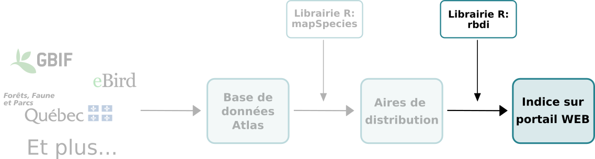
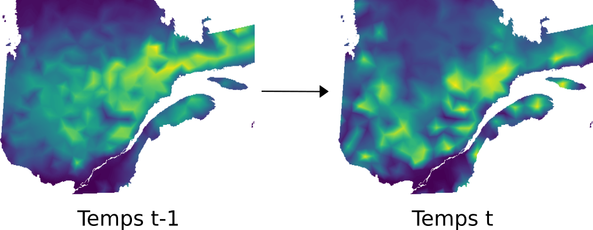

```{r setup, echo = F}
knitr::opts_chunk$set(
  comment = "#",
  #cache = TRUE,
  collapse = TRUE,
  warning = FALSE,
  message = FALSE,
  fig.width = 7,
  fig.height = 5.25,
  fig.align = 'center',
  fig.retina = 3
)

# base plot layout
mypar = list(mar = c(3,3,0.5,0.5), mgp = c(1.5, 0.3, 0), tck = -.008)

# xaringan Extra
xaringanExtra::use_xaringan_extra(c("tile_view", "animate_css", "tachyons"))
xaringanExtra::use_extra_styles(
  hover_code_line = TRUE,         #<<
  mute_unhighlighted_code = TRUE  #<<
)
xaringanExtra::use_editable(expires = 1)
xaringanExtra::use_panelset()
```
class: middle, title-slide

<div class="my-logo-left"></div>

# Suivi de biodiversité au Québec

<hr width="65%" align="left" size="0.3" color="#33638d"></hr>

## Biodiversity Distribution Index

### Vincent Bellavance

<br>
<i class="fa fa-github fa-lg" style="color:#e7e8e2"></i> [VincentBellavance/seminar1](https://github.com/VincentBellavance/seminar1)

<i class="fa fa-twitter fa-lg" style="color:#e7e8e2"></i> [@v_bellavance](https://twitter.com/v_bellavance)

---

# Les objectifs d'Aichi 2020
<hr width="100%" align="left" size="0.3" color="#33638d"></hr>

- Objectifs d'Aichi 2020

--

- _Global Biodiversity Outlook_

--

- Déclin s'accélère et actions insuffisantes

--

- IPBES, FAO, etc.

--

- Importance des suivis de biodiversité

???

C'est cette année que se terminait la décennie pour la biodiversité qui a été déclarée par l'ONU en 2011. Cette décennie servait à promouvoir le plan stratégique 2011-2020 et les objectifs d'Aichi, tous deux adopté par les parties de la Convention sur la Diversité Biologique, un traité international signé par plus de 160 pays en 1992 qui vise la conservation de la biodiversité. Les objectifs d'Aichi représente 20 objectifs visant à réduire la perte de biodiversité à l'échelle globale. Dnas le cadre de la dernière année de la décennie, les parties de la CBD a sorti un rapport afin d'évaluer l'atteinte des objectifs d'Aichi. Le rapport conclu qu'aucun des objectifs n'ont été atteints. Ce rapport conclut que la perte de biodiversité s'accélère et que les actions de conservation ne sont pas assez importantes pour ralentir ce déclin. Cette conclusion est également partagé dans les rapports de l'Organisation des Nations unies pour l'alimentation et l'agriculture (FAO) et de la Plateforme intergouvernementale scientifique et politique sur la biodiversité et les services écosystémiques (IPBES), qui est à la biodiversité ce que le Groupe d'experts intergouvernemental sur l'évolution du climat (IPCC) est au climat. Le message général de ces rapports est donc qu'il faut en faire beaucoup plus pour protéger la biodiversité. Tous ces organismes rappellent également l'importance d'implémenter des suivis de biodiversité à l'échelle régional, national et sub-national afin d'avoir de mieux mesurer les changements de biodversité et mieux identifier les besoins en conservation.
---

# Défis des suivis de biodiversité
<hr width="100%" align="left" size="0.3" color="#33638d"></hr>

- Difficulté à définir la biodiversité

--

- Interprétation des changements de biodiversité

--

  - Ex: local vs global

--

- Échelle temporelle

--

- Altération vs perte

--

- Manque de donnéess

--

- Harmonisations des données

???

Les suivis de biodiversité ne sont pas vraiment simple à faire. Le simple fait de définir la biodiversité n'est pas nécessairement facile. Cela vient entres autres du fait que la biodiversité se présente sous plusieurs dimensions différentes: génétique, composition de la communauté, services écosystèmes, interactions entre espèces, etc. Même lorsqu'on réussit à bien définir ce qu'on veut mesurer, l'interprétation des changements de biodiversité peut mener à plusieurs débats. Par exemple, il y a le débat sur les changements de biodiversité à l'échelle locale vs globale qui est réapparu depuis quelques années. D'un côté, on dit que la biodiversité globale est sur le déclin et que c'est la catastrophe. De l'autre, on est pas si alarmiste. Puisque c'est les services écosystémiques dépendent de la biodiversité locale, certains chercheurs croient qu'on devrait se concentrer sur la biodiversité locale, qui ne semble pas décliner autant. Il faut donc faire attention à l'échelle spatiale et en tenir compte dans l'analyse des résultats. Il faut aussi faire attention à l'échelle temporelle. Il faut être conscient qu'on compare toujours la biodiversité aujourd'hui à celle d'un autre moment. Ce sont des mesures relatives. De plus, ce n'est pas tous les taxons qui réagissent à la même vitesse aux changements de l'environnement et important d'avoir des données à un intervalle qui nous permet de capter les changements (arbres vs insectes). Important également de différencier la perte vs. l'altération. Par exemple, si on ne mesure que des espèces indigènes et que ces espèces se font remplacer par des espèces exotiques, nos résultats vont démontrer qu'il y a une perte de biodiversité. Si on prend toutefois les espèces exotiques en compte, on va plutôt observer une altération de la biodiversité, c'est-à-dire qu'on ne perd pas nécessairement de biomasse ou d'abondance d'espèce, mais que les espèces présentes à un endroit seront différentes. Il y a toutefois un problème qui représente un plus gros défi dans les mesures de changements de biodiversité: le manque de données. Beaucoup moins de données dans les Tropiques et les pays en voie de développement et beaucoup plus en Europe et en Amérique du Nord. Ça amène de gros biais taxonomiques et spatial, limite l'interprétation des résultats. C'est donc nécessaire d'utiliser le plus grand nombre de données possibles de divers sources. Ces données doivent toutefois être harmonisées. 

---

# Les variables essentielles de biodiversité
<hr width="100%" align="left" size="0.3" color="#33638d"></hr>

- Harmoniser les données sur la biodiversité

--

- Six classes de VEBs (avec schéma) et chaque classes représente plusieurs variables:
  - Génétique
  - Population d'espèce
  - Traits d'espèce
  - Composition communauté
  - Structure d'écosystème
  - Fonctions d'écosystème

--

- Population d'espèce:

--

  - Modélisation (Modèles de distribution d'espèces)

--

- Pont entre données brutes et indicateurs de biodiversité

???

C'est là qu'entre en jeu les variables de biodiversité essentielles. Ces variables, dont le développement est toujours en cours, ont pour but d'harmoniser les données sur la biodiversité en proposant un ensemble minimales permettant d'évaluer les changements de biodiversité. Ces variables d'état à trois dimensions (temps, espace et organisation biologique) doivent être biologiques (pas de nutriments, pas de pressions anthropiques, etc.), sensibles aux changements et indépendants des écosystèmes afin de faciliter les comparaisons. Les VEBs sont divisées en six classes afin de couvrir les dimensions majeures de la biodiversité. Un groupe de travail par classe s'affère présentement au développement des variables. Certaines classes de VEBs ont eu un développement plus rapide que d'autres. C'est le cas notamment de la VEB d'espèce de population. Dans cette classe, la modélisation a été identifié comme un outil très important pour combler le manque de données et pour les harmoniser. Avec des modèles de distribution d'espèce (SDM), on peut transformer les données brutes (qui sont éparses dans le temps et l'espace) en un cube de données dont les trois axes sont le temps, l'espace et la taxonomie. Ce cubre fait le pont entre les données brutes et les indicateurs de biodiversité qui vont être calculés avec les VEBs. 

---

# Les indicateurs de biodiversité
<hr width="100%" align="left" size="0.3" color="#33638d"></hr>

- Représenter changements de manière simplifiés

--

- Sous forme de série temporelle

--

- Informer les décideurs et le public

--

- Doit être facilement compréhensible et basé sur des données disponibles

--

- Plus d'une soixantaine:
  - LPI
  - RLI
  - WBI

???

Les indicateurs de biodiversité sont des indices qui représentent l'état de la biodiversité de manière simplifiée. Comme la biodiversité est un concept très large, ces indices doivent viser un aspect précis ce celle-ci. Ces indicateurs vont être représentés sous forme de série temporelle, ce qui permet de visualiser l'évolution de la mesure au fil du temps. Ils sont très utiles pour informer les décideurs et le public sur l'atteinte d'une cible de conservation et simplement sur l'état de la biodiversité. Elles permettent également de voir si des politiques et des actions ayant pour but la conservation de la biodiversité ont eu les impacts escomptés. Pour cela, l'indicateur doit être facilement compréhensible et communicable et doit bien répondre aux changements. L'indicateurs doit également être basé sur des données disponibles si on veut voir une évolution. La mise en place par la Convention sur la Diversité Biologique des objectifs pour la biodiversité de 2010 suivi des objectifs d'Aichi 2020 a grandement accélérer le développement de plusieurs indicateurs. Il en existe aujourd'hui plus de 60. Le Red List Index, le Wild Bird Index et le Living Planet Index font partis des indicateurs les mieux développés et les plus connus. RLI: Risque d'extinction des espèces. WBI: LPI pour les oiseaux
---

# Le Living Planet Index
<hr width="100%" align="left" size="0.3" color="#33638d"></hr>

- Mesure des changements moyens de la taille des populations de vertébrés à chaque année depuis 1970

--

- Utilise les suivis de population à long terme (même méthodologie et min. 2 ans)

--

- Peut-être caculer globalement, pour une région précise ou pour un groupe taxonomique

--

- Non, on a pas perdu 68% des vertébrés dans le mondiales

--

- La taille des populations de vertébrés à diminué en moyenne de 68%

---

# La biodiversité à l'échelle globale
<hr width="100%" align="left" size="0.3" color="#33638d"></hr>

- Diminution moyenne de la taille des populations plus importantes en **Afrique (-65%)** et surtout en **Amérique du Sud (-94%...)**

--


- **Amérique du Nord (-33%)** et **Europe/nord de l'Asie (-24%)**

--


- Résultats nuancés par certaines recherches (Daskalova 2018):
  - Pop déclin = Pop augmentation
  - Amphibiens = Seul à décliner

--

- le RLI: **Risques d'extinction augmentent** de plus en plus pour tous les taxons étudiés

--

- Le WBI: Diminution d'environ **20% pour les espèces d'oiseaux**
  - **40% pour les oiseaux spécialistes**

???

RLI: Taxons étudiés: Amphibiens, Coraux, Oiseaux, Mammifères, Cycadales (ordre de gymnospermes qui vit dans les tropiques)

---

# La biodiversité au Canada
<hr width="100%" align="left" size="0.3" color="#33638d"></hr>

- LPI: Tendance **relativement stable** (6%)

--

- RLI: Également **stable** (risque d'extinction augmente de 0.8%)

--

- WBI, Oiseaux en déclin:
  - Oiseaux de rivage **(-40%)**
  - Oiseaux de prairies **(-57%)**
  - Insectivores aériens **(-59%)**

--

- WBI, Oiseaux en augmentation:
  - Sauvagine **(150%)**
  - Oiseaux de proie **(110%)**

???

Plusieurs indicateurs sont disponibles pour le Canada. En général, la biodiversité au Canada semble relativement bien se porter. La taille moyenne des population de vertébrés est relativement stable avec un augmentation moyenne de 6%. Le Red List Index est également stable avec une augmentation de risque d'extinction moyen de 0.8%. Le rapport de l'état des populations d'oiseaux du Canada est un des autres suivis de biodiversité du pays. Il utilise le WBI pour mesurer le changement moyen dans la taille des populations de groupe taxonomique d'oiseaux. Les changements varient énormément selon le groupe. Les oiseaux de rivage, de prairies et les insectivores aériens sont les oiseaux les plus en déclin. Les populations de sauvagine et d'oiseaux de proie sont quant à eux en forte hausse d'abondance. Il y a somme toute plusieurs suivi de biodiversité pour le Canada, ce qui nous permet de nous faire une idée générale de l'état de cette biodiversité.

---

# La biodiversité au Québec
<hr width="100%" align="left" size="0.3" color="#33638d"></hr>

- Aucun suivi de biodiversité

--

- CDPNQ: espèces à statut

--

- Manque de données

--

- Orientation du gouvernement

???

À l'échelle du Québec, toutefois, il n'existe pas, à pas connaissance, de suivi de biodiversité semblable à ceux du Canada (LPI, RLI, WBI, etc.). C'est donc difficile, voir impossible, présentement, de dire comment la biodiversité à changé au Québec dans les dernières décennies. Le Centre de données sur le patrimoine naturel du Québec (CDPNQ) est un des acteurs importants du Québec dans le suivi de la biodiversité, mais son mandat est principalement relié (mais ne se limite pas) le suivi des espèces à statut. Le manque de données, comme les suivis de populations à long terme pour calculer des indices comme le LPI, nuit fortement à toutes initiatives de suivi de biodiversité. Il est important de mettre en place de tel suivi puisque l'évaluation de la biodiversité et l’élabo-
ration d’un réseau de suivi fait partie des orientations du gouvernement du Québec en matière de diversité écologique.
---

# Questions
<hr width="100%" align="left" size="0.3" color="#33638d"></hr>
<br>

> .font110[Comment la biodiversité à changé au Québec dans les dernières décennies?]

<br>

--

<br>

> .font110[Est-il possible de développer un indice utilisant les données d'occurrence et d'abondance disponibles?]

---

# Objectifs
<hr width="100%" align="left" size="0.3" color="#33638d"></hr>
<br>
.font110[Objectif général:]
<br><br>
> **.font120[.center[Développer un indice de changement de biodiversité basé sur la distribution des espèces]]**

<br><br>
--

.font110[Objectif secondaire:]
<br><br>
>**.font120[.center[Développer le pipeline qui permettra d'automatiser le calcul de l'indice avec la base de données ATLAS et de représenter le résultat au moyen d'un outil web interactif]]**

---

# Méthodes
<hr width="100%" align="left" size="0.3" color="#33638d"></hr>

.center[]

---

# Méthodes
<hr width="100%" align="left" size="0.3" color="#33638d"></hr>

.center[]

---

# Méthodes
<hr width="100%" align="left" size="0.3" color="#33638d"></hr>

.center[]

.font110[- Données d'abondance et d'occurrence des espèces du Québec]
--
.font110[
- Proviennent de plusieurs sources dont:
  - Gouvernementales
  - Base de données ouvertes (e.g. GBIF)
  - Science citoyenne
]
--
.font110[
- Standard d'informations pour les observations sur la biodiversité au Québec
]

---

# Méthodes
<hr width="100%" align="left" size="0.3" color="#33638d"></hr>

.center[]

---

# Méthodes
<hr width="100%" align="left" size="0.3" color="#33638d"></hr>

.center[]

.left[]

---

# Méthodes
<hr width="100%" align="left" size="0.3" color="#33638d"></hr>

.center[]

.left[]

--

<div style="float: right; position: relative; font-size: 120%; top: -19vh; left: -8vh;">10km x 10km</div>

--

.right[]

--

.right[]

---

# Méthodes
<hr width="100%" align="left" size="0.3" color="#33638d"></hr>

.center[]

---

# Méthodes
<hr width="100%" align="left" size="0.3" color="#33638d"></hr>

.center[]

.left[]

---

# Méthodes
<hr width="100%" align="left" size="0.3" color="#33638d"></hr>

.center[]

.left[]

---

# Méthodes
<hr width="100%" align="left" size="0.3" color="#33638d"></hr>

.center[]

.left[]

--

<div style="position: relative; top: -9vh; left: 22vh">$$d_{i,t} = log_{10}(\frac{P(occ)_{i,t}}{P(occ)_{i,t-1}})$$</div>

---

# Méthodes
<hr width="100%" align="left" size="0.3" color="#33638d"></hr>

.center[]

.left[]

---

# Méthodes
<hr width="100%" align="left" size="0.3" color="#33638d"></hr>

.center[]

.left[]

--

<div style="position: relative; top: -25vh; left: 22vh">$$\bar{d}_t = \frac{1}{n} \sum_{i=1}^{n} \bar{d}_{i,t}$$</div>

---

# Méthodes
<hr width="100%" align="left" size="0.3" color="#33638d"></hr>

.center[]

<br><br>
.center[.font140[Pour j espèces:]]
<br>
<div style="position: relative; left: 5vh">$$\bar{d}_t = \frac{1}{j} \sum_{k=1}^{j} \bar{d}_{k,t}$$</div>

---

# Méthodes
<hr width="100%" align="left" size="0.3" color="#33638d"></hr>

.center[]

<br>
<div style="position: relative; left: 7vh">$$I_t = I_{t-1} 10^{\bar{d}_t}$$</div>

<br><br><br><br>

- Moyenne géométrique de 0.5 et 2 = 1
<br>

- Moyenne arythmétique de 0.5 et 2 = 1.25

---

# Limites
<hr width="100%" align="left" size="0.3" color="#33638d"></hr>

- Approche grossière

--

- Oiseaux et arbres seulement

--

- Problèmes de détection des observations (fausses présences et fausses absences)

--

Séquences de colonisation et extinction erronées

---

# Avancement
<hr width="100%" align="left" size="0.3" color="#33638d"></hr>

- Harmonisations des données

--

- Librairie R pour les SDMs en développement

--

- Librairie R pour le calcul de l'indice en développement

---

# Pour la suite

- Corrélation entre variation biodiversité et pressions anthropiques

--

- Partionner entre les colonisations et les extinctions

--

- Étudier les propriétés de l'indice, notamment l'incertitude